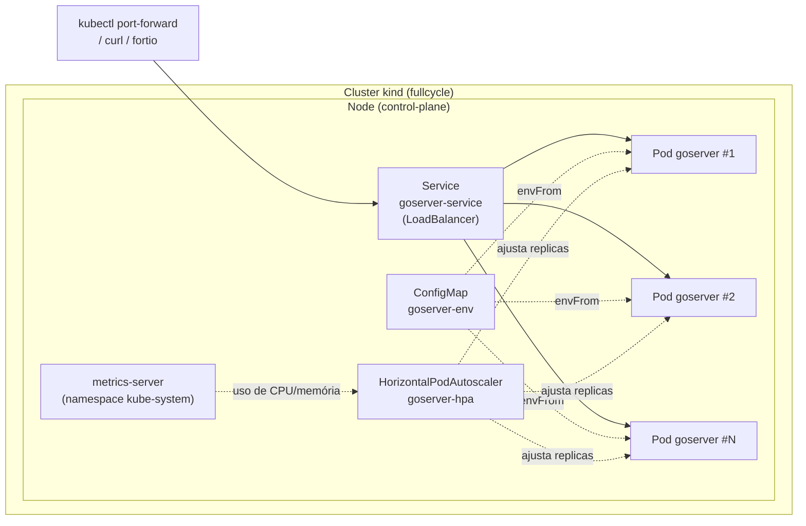

# goserver — Laboratório de Kubernetes (Full Cycle)


Um servidor HTTP em Go minimalista, containerizado com Docker e implantado
em um cluster Kubernetes local (via [kind](https://kind.sigs.k8s.io/)),
usado como laboratório prático dos conceitos centrais do Kubernetes:
**Pod, Deployment, Service, ConfigMap, Probes e Horizontal Pod Autoscaler
(HPA)**. Feito ao longo do curso de Kubernetes da [Full Cycle](https://fullcycle.com.br/).

Não é uma aplicação de produção — é um projeto de estudo, então este
README documenta não só "como rodar", mas **o que cada peça faz e por
quê**, incluindo os manifests linha a linha.

## Índice

- [Arquitetura](#arquitetura)
- [Pré-requisitos](#pré-requisitos)
- [Como rodar (passo a passo)](#como-rodar-passo-a-passo)
- [Testando a aplicação](#testando-a-aplicação)
- [Conceitos do Kubernetes](#conceitos-do-kubernetes)
- [Estrutura do repositório](#estrutura-do-repositório)
- [Os manifests, linha a linha](#os-manifests-linha-a-linha)
- [Cálculo de recursos (CPU e memória)](#cálculo-de-recursos-cpu-e-memória)
- [Testando o autoscaling com fortio](#testando-o-autoscaling-com-fortio)
- [Comandos principais](#comandos-principais)
- [Limitações conhecidas e decisões de projeto](#limitações-conhecidas-e-decisões-de-projeto)
- [Documentação completa](#documentação-completa)

## Arquitetura



O `Deployment` (`goserver`) garante que N réplicas do Pod estejam sempre
no ar; o `Service` distribui tráfego entre elas; o `HPA` observa o uso de
CPU (via `metrics-server`) e ajusta N automaticamente; o `ConfigMap`
injeta variáveis de ambiente em cada Pod.

## Pré-requisitos

| Ferramenta | Para quê | Instalação |
|---|---|---|
| [Docker](https://www.docker.com/) | Buildar a imagem e rodar os nodes do `kind` | `brew install --cask docker` |
| [kind](https://kind.sigs.k8s.io/) | Criar o cluster Kubernetes local | `brew install kind` |
| [kubectl](https://kubernetes.io/docs/tasks/tools/) | Interagir com o cluster | `brew install kubectl` |
| `watch` | Acompanhar comandos em loop (não vem por padrão no macOS) | `brew install watch` |
| [fortio](https://github.com/fortio/fortio) *(opcional)* | Gerar carga para testar o HPA | roda direto no cluster, via `kubectl run` — ver [seção própria](#testando-o-autoscaling-com-fortio) |
| Conta no [Docker Hub](https://hub.docker.com/) | Publicar a imagem (`docker push`) | `docker login` |

## Como rodar (passo a passo)

```bash
# 1. Clonar o repositório
git clone https://github.com/ThomasMoraes02/k8s-kubernetes.git
cd k8s-kubernetes

# 2. Buildar a imagem Docker
docker build -t thomasmoraes02/hello-go:v1 .

# 3. Criar o cluster local
kind create cluster --name fullcycle

# 4. Levar a imagem para dentro do cluster kind
#    (alternativa a publicar no Docker Hub — ver docs/kind.md)
kind load docker-image thomasmoraes02/hello-go:v1 --name fullcycle

# 5. Aplicar os ConfigMaps primeiro
#    (o Deployment referencia goserver-env via envFrom — precisa existir antes)
kubectl apply -f k8s/configmap-env.yaml
kubectl apply -f k8s/configmap-family.yaml

# 6. Ajustar a tag da imagem em k8s/deployment.yaml para "v1" (ou a que você buildou)
#    e aplicar o Deployment
kubectl apply -f k8s/deployment.yaml

# 7. Aplicar o Service
kubectl apply -f k8s/service.yaml

# 8. (Opcional) Instalar o metrics-server e o HPA
kubectl apply -f k8s/metrics-server.yaml
kubectl apply -f k8s/hpa.yaml

# 9. Acompanhar os Pods subindo
watch -n1 kubectl get pods
```

## Testando a aplicação

```bash
kubectl port-forward svc/goserver-service 8080:80
```

```bash
curl localhost:8080/           # "Hello, I'm Thomas, Age: 26" + "<h1>Hello Full Cycle!</h1>"
curl localhost:8080/healthz    # "ok" (depois dos primeiros 10s de vida do Pod) — ver seção de Probes
curl -i localhost:8080/        # inclui headers de resposta
```

## Conceitos do Kubernetes

### Cluster e Node

Um **cluster** Kubernetes é um conjunto de máquinas (**nodes**) que juntas
executam suas aplicações containerizadas. Existem dois papéis de node:
**control-plane** (a "cabeça" do cluster — decide onde cada Pod roda,
guarda o estado desejado, expõe a API) e **worker** (onde os Pods
realmente rodam). O [kind](docs/kind.md) simula tudo isso localmente,
usando containers Docker como se fossem nodes — o cluster deste projeto
(`fullcycle`) tem só um node fazendo os dois papéis ao mesmo tempo.

### Pod

O **Pod** é a menor unidade que o Kubernetes agenda e gerencia — não é o
container em si, é um invólucro em torno de um ou mais containers que
compartilham rede e armazenamento. Pods são **efêmeros e descartáveis**:
podem morrer e ser recriados a qualquer momento, sempre com um IP novo.
Por isso quase nunca se cria um Pod diretamente (como em
[`k8s/pod.yaml`](k8s/pod.yaml), usado aqui só para fins didáticos) — o
normal é deixar um Deployment gerenciar isso. Leitura completa:
[docs/pods.md](docs/pods.md).

### Deployment e ReplicaSet

O **Deployment** declara *como* uma aplicação deve rodar: qual imagem,
quantas réplicas, como atualizar sem downtime. Por baixo, ele cria e
gerencia um **ReplicaSet**, que é quem efetivamente garante que o número
de Pods vivos bata com o declarado — se um Pod morre, o ReplicaSet cria
outro. O Deployment também guarda um histórico de revisões, permitindo
`kubectl rollout undo` para voltar a uma versão anterior. Leitura
completa: [docs/deployments.md](docs/deployments.md).

### Service

Como os Pods são efêmeros e trocam de IP, o **Service** dá um nome estável
e um IP/DNS fixo para um grupo de Pods (selecionados por `labels`),
funcionando como um load balancer interno. Existem três tipos:
`ClusterIP` (só dentro do cluster), `NodePort` (abre uma porta fixa em
todos os nodes) e `LoadBalancer` (pede um load balancer externo real ao
provedor de nuvem — no `kind`, fica `<pending>` para sempre, por isso se
usa `kubectl port-forward` localmente). Leitura completa:
[docs/services.md](docs/services.md).

### ConfigMap

Um **ConfigMap** guarda configuração (não segredos) fora da imagem
Docker, como pares chave-valor — permitindo trocar comportamento sem
rebuildar a imagem. Pode ser injetado como variáveis de ambiente
(`envFrom`/`env`, usado em [`k8s/deployment.yaml`](k8s/deployment.yaml))
ou montado como arquivo dentro do Pod (via volume — não usado atualmente
neste projeto, ver [Limitações conhecidas](#limitações-conhecidas-e-decisões-de-projeto)).

### Probes (startup, readiness, liveness)

Uma **probe** é uma verificação de saúde que o kubelet faz periodicamente
contra um container:

- **`startupProbe`** — "já terminou de inicializar?" Enquanto não passa,
  as outras duas ficam pausadas. Protege boots lentos sem precisar inflar
  o delay da liveness.
- **`readinessProbe`** — "está pronto pra receber tráfego?" Se falhar, o
  Pod só sai da rota do Service — o container **não** é reiniciado.
- **`livenessProbe`** — "ainda está vivo?" Se falhar repetidamente, o
  kubelet **mata e recria** o container (self-healing).

Leitura completa, incluindo como a rota `/healthz` deste projeto foi
desenhada especificamente para demonstrar esse comportamento:
[docs/probes.md](docs/probes.md).

### HPA e metrics-server

O **HorizontalPodAutoscaler (HPA)** ajusta automaticamente o número de
réplicas de um Deployment com base em métricas (aqui, % de uso de CPU),
criando Pods sob carga alta e removendo sob carga baixa. Ele depende do
**metrics-server** — um componente que coleta uso de CPU/memória de cada
Pod/node e alimenta tanto o HPA quanto `kubectl top`. Sem ele, o HPA fica
em `<unknown>` e não escala nada. Leitura completa, com o cálculo exato de
quando o HPA decide escalar: [docs/autoscaling.md](docs/autoscaling.md).

## Estrutura do repositório

```
kubernetes/
├── server.go                 # aplicação Go: rotas /, /healthz, /configmap
├── Dockerfile                 # build da imagem golang:1.15-alpine
├── k8s/
│   ├── pod.yaml                # Pod isolado (uso didático, não usado em produção)
│   ├── deployment.yaml         # Deployment: réplicas, probes, resources, env
│   ├── service.yaml            # Service tipo LoadBalancer
│   ├── configmap-env.yaml      # ConfigMap injetado como env vars (NAME, AGE)
│   ├── configmap-family.yaml   # ConfigMap de exemplo (não usado no Deployment ainda)
│   ├── hpa.yaml                # HorizontalPodAutoscaler do Deployment goserver
│   ├── metrics-server.yaml     # Instalação do metrics-server, adaptada para kind
│   ├── statefulset.yaml        # StatefulSet de MySQL (laboratório de volumes)
│   ├── mysql-service.yaml      # Service headless que dá identidade de rede ao StatefulSet
│   ├── pvc.yaml                # PersistentVolumeClaim avulsa (montada no Deployment goserver)
│   ├── ingress-nginx.yaml      # Instalação do controller ingress-nginx (adaptada para kind)
│   └── ingress.yaml            # Ingress roteando goserver.local -> goserver-service
└── docs/                      # documentação aprofundada (em português)
    ├── README.md                # índice e fluxo completo
    ├── kubernetes.md             # cluster, nodes
    ├── pods.md                   # conceito de Pod
    ├── deployments.md            # conceito de Deployment
    ├── probes.md                 # startup/readiness/liveness probes
    ├── autoscaling.md            # resources/limits, HPA, metrics-server, fortio
    ├── services.md                # conceito de Service
    ├── kind.md                    # cluster local e carregamento de imagens
    ├── kubectl.md                 # comandos do kubectl
    └── golang.md                  # build/push/versionamento da imagem
```

## Os manifests, linha a linha

### `k8s/deployment.yaml`

```yaml
apiVersion: apps/v1              # versão da API do Kubernetes para o recurso Deployment
kind: Deployment                 # tipo de objeto: Deployment (gerencia réplicas de Pods via ReplicaSet)
metadata:
  name: goserver                 # nome do Deployment (kubectl get deployment goserver)
  labels:
    app: goserver                # label do próprio objeto Deployment (não dos Pods gerados)
spec:
  selector:
    matchLabels:
      app: goserver               # quais Pods pertencem a este Deployment: os com label app=goserver
  replicas: 1                     # nº de réplicas desejado (o HPA sobrescreve isso em runtime quando ativo)
  template:                       # a partir daqui: o "molde" de Pod usado para criar cada réplica
    metadata:
      labels:
        app: "goserver"           # label aplicada a cada Pod — precisa bater com spec.selector.matchLabels
    spec:
      containers:
      - name: goserver             # nome do container dentro do Pod

        image: "thomasmoraes02/hello-go:v5.6"  # imagem+tag a rodar — cada alteração no server.go exige nova tag (ver docs/golang.md)

        startupProbe:               # "já terminou de inicializar?" — pausa readiness/liveness até passar
          httpGet:
            path: /healthz          # rota HTTP chamada pelo kubelet
            port: 80                 # porta real do processo Go (server.go escuta em :80)
          periodSeconds: 3           # verifica a cada 3s
          failureThreshold: 30       # tolera até 30 falhas seguidas → janela de boot de até 90s (30 × 3s)

        # Sem mandar tráfego para a aplicação
        readinessProbe:              # "está pronto pra receber tráfego?"
          httpGet:
            path: /healthz
            port: 80
          periodSeconds: 3           # verifica a cada 3s
          failureThreshold: 1        # 1 falha já tira o Pod da rota do Service (container continua rodando)
          initialDelaySeconds: 10     # espera 10s após o container iniciar antes da 1ª checagem

        # Faz uma requisição interna para o container
        livenessProbe:               # "ainda está vivo?"
          httpGet:
            path: /healthz
            port: 80
          periodSeconds: 5           # verifica a cada 5s
          failureThreshold: 1        # 1 falha já derruba e reinicia o container
          timeoutSeconds: 1          # timeout de 1s por checagem antes de contar como falha
          successThreshold: 1        # tem que ser 1 aqui — é o único valor aceito pela API para livenessProbe
          initialDelaySeconds: 15     # espera 15s após o container iniciar antes da 1ª checagem

        # Recursos
        resources:                   # reserva (requests) e teto (limits) de CPU/memória
          # O minimo que a aplicação precisa para rodar
          # Estamos reservando esses recursos do nosso cluster para esse POD
          requests:
            # Unidade de medida de CPU: vCPU -> 1000m (milicores)
            cpu: "0.05"               # reserva 0,05 vCPU (50m) — é a base do cálculo de % do HPA
            memory: "20Mi"            # reserva 20 mebibytes de memória

          # Até onde o POD pode usar de recursos do nosso cluster
          limits:
            cpu: "0.05"               # teto de CPU (igual ao request aqui — nunca ultrapassa, nunca sofre throttling extra)
            memory: "25Mi"            # teto de memória — ultrapassar isso mata o container (OOMKilled)

        envFrom:                      # injeta TODAS as chaves de um ConfigMap como variáveis de ambiente
          - configMapRef:
              name: goserver-env      # nome do ConfigMap (k8s/configmap-env.yaml) — precisa existir antes de aplicar este Deployment

        # Alternativas
        # env:                       # forma alternativa: injetar variáveis uma a uma, escolhendo a chave
        #   - name: NAME
        #     valueFrom:
        #       configMapKeyRef:
        #         name: goserver-env
        #         key: NAME

        #   # tem esse caminho
        #   - name: AGE
        #     value: "26"
        ports:
        - containerPort: 8080         # ⚠️ apenas documentação, não abre porta sozinho — e diverge da porta real (80), ver "Limitações conhecidas"
```

### `k8s/pod.yaml`

```yaml
apiVersion: v1                    # Pod é da API "core" (v1), diferente de Deployment (apps/v1)
kind: Pod                          # cria um Pod isolado, sem ReplicaSet/self-healing por trás
metadata:
  name: "goserver"                 # nome do Pod
  labels:
    app: "goserver"                # label usada por Services/seletores
spec:
  containers:
    - name: "goserver"              # nome do container
      image: "thomasmoraes02/hello-go:latest"  # imagem — aqui usa "latest" só para fins didáticos (ver docs/golang.md sobre por que evitar em geral)
```

Usado apenas para observar um Pod "cru" — sem réplicas, sem rolling
update, sem self-healing. Se ele morrer, **ninguém o recria**. Na prática
do projeto, o Deployment é quem gerencia os Pods reais.

### `k8s/service.yaml`

```yaml
apiVersion: v1                     # Service é da API "core" (v1)
kind: Service
metadata:
  name: goserver-service            # nome do Service (kubectl get svc goserver-service)
spec:
  selector:
    app: goserver                   # seleciona todos os Pods com label app=goserver (os do Deployment)
  type: LoadBalancer                 # pede um load balancer externo (fica <pending> no kind — use port-forward)
  ports:
  - name: goserver-service            # nome da porta (obrigatório quando há mais de uma; aqui é só uma)
    port: 80                          # porta em que o Service escuta (quem consome usa esta)
    targetPort: 80                    # porta do container para onde o tráfego é encaminhado (bate com server.go)
    protocol: TCP                     # protocolo da porta
    # nodePort: 30001 Para que serve?  # comentado: fixaria manualmente a porta externa (30000-32767); sem isso, o k8s escolhe uma
```

### `k8s/configmap-env.yaml`

```yaml
apiVersion: v1
kind: ConfigMap
metadata:
  name: goserver-env      # nome referenciado em deployment.yaml (envFrom.configMapRef.name)
data:
  NAME: "Thomas"           # vira a variável de ambiente NAME dentro do container
  AGE: "26"                # vira a variável de ambiente AGE dentro do container
```

Consumido por `Hello()` em [server.go](server.go#L21-L29) via
`os.Getenv("NAME")`/`os.Getenv("AGE")`.

### `k8s/configmap-family.yaml`

```yaml
apiVersion: v1
kind: ConfigMap
metadata:
  name: configmap-family
data:
  members: "Thomas, Caique, Isabella, Igor"   # valor de exemplo, chave única "members"
```

⚠️ Este ConfigMap existe no repositório mas **não é referenciado** por
nenhum manifest atualmente (nem `envFrom`, nem volume) — ver
[Limitações conhecidas](#limitações-conhecidas-e-decisões-de-projeto).

### `k8s/hpa.yaml`

```yaml
apiVersion: autoscaling/v1          # API mais simples do HPA — só suporta CPU (a v2 suporta múltiplas métricas)
kind: HorizontalPodAutoscaler
metadata:
  name: goserver-hpa
spec:
  scaleTargetRef:
    apiVersion: apps/v1              # aponta para o mesmo Deployment documentado acima
    name: goserver
    kind: Deployment
  # Escala no máximo 5 replicas       ⚠️ comentário desatualizado — o valor abaixo é 30, não 5
  minReplicas: 1                      # nunca escala abaixo de 1 réplica
  maxReplicas: 30                     # nunca escala acima de 30 réplicas
  targetCPUUtilizationPercentage: 25  # mantém a média de uso de CPU em ~25% do requests.cpu de cada Pod
```

### `k8s/metrics-server.yaml`

Manifest oficial do [metrics-server](https://github.com/kubernetes-sigs/metrics-server)
(baixado via `wget .../components.yaml`), com **uma única alteração**: a
flag `--kubelet-insecure-tls` foi adicionada aos `args` do container. Sem
ela, o metrics-server rejeita a conexão com os kubelets do `kind`, que
usam certificados TLS self-signed — algo que não existiria em um cluster
gerenciado (EKS/GKE/AKS) com certificados válidos.

O restante do arquivo (204 linhas) é infraestrutura padrão para o
metrics-server funcionar: um `ServiceAccount` + `ClusterRole`s +
`RoleBinding`s/`ClusterRoleBinding`s (dão a ele permissão de **ler**
métricas de Pods/nodes via RBAC), um `Service` interno (expõe o
metrics-server na porta `443` dentro do cluster) e um `APIService`
(registra `metrics.k8s.io/v1beta1` na API do Kubernetes, para que
`kubectl top` e o HPA consigam consultá-lo como se fosse uma API nativa).
Detalhes de instalação e verificação: [docs/autoscaling.md](docs/autoscaling.md#pré-requisito-metrics-server).

## Cálculo de recursos (CPU e memória)

### Unidades

- **CPU**: medida em **vCPU** (núcleo virtual). `1000m` (millicores) = `1`
  vCPU inteira. `100m` = 0,1 vCPU. Este projeto usa a notação fracionária
  (`"0.05"`), exatamente equivalente a `"50m"`.
- **Memória**: em `Mi` (mebibytes, base 1024) ou `Gi` (gibibytes) —
  diferente de `M`/`G` (base 1000, menos comum no dia a dia do
  Kubernetes).

### `requests` vs `limits`

```yaml
requests:
  cpu: "0.05"      # 50m — reservado garantidamente; base do cálculo de % do HPA
  memory: "20Mi"
limits:
  cpu: "0.05"       # 50m — teto; CPU acima disso sofre throttling (não mata o processo)
  memory: "25Mi"    # teto; memória acima disso mata o container (OOMKilled)
```

- **`requests`**: quanto o container **reserva** garantidamente. O
  `kube-scheduler` só coloca o Pod em um node com essa quantidade livre.
- **`limits`**: o **teto** de consumo. CPU acima do limite sofre
  *throttling* (fica mais lento); memória acima do limite derruba o
  container imediatamente.

### QoS Class

O Kubernetes classifica cada Pod em uma classe de qualidade de serviço,
que influencia quem é despejado primeiro quando um node fica sob pressão
de recursos:

| Classe | Quando acontece | Neste projeto? |
|---|---|---|
| `Guaranteed` | `requests == limits` para **todo** recurso, em **todo** container | Não — CPU bate (`0.05 == 0.05`), mas memória não (`20Mi != 25Mi`) |
| `Burstable` | Ao menos um `requests`/`limits` definido, mas nem todos batem | **É esta** — confirme com `kubectl get pod <nome> -o jsonpath='{.status.qosClass}'` |
| `BestEffort` | Nenhum `requests`/`limits` definido | Não se aplica aqui |

### A matemática do HPA

```
réplicas desejadas = ceil( réplicas atuais × (uso atual de CPU / uso alvo de CPU) )
```

Com `requests.cpu: 50m` e `targetCPUUtilizationPercentage: 25` (de
[`k8s/hpa.yaml`](k8s/hpa.yaml)):

- Uso alvo = 25% de `50m` = **12,5m** por Pod.
- Se a média de uso sobe para `25m` (50% de utilização):
  `ceil(1 × (25/12,5)) = 2` → escala para 2 réplicas.
- Se a média sobe mais, para `100m` (200% de utilização, com 2 réplicas):
  `ceil(2 × (100/12,5)) = 16` → continuaria escalando (até o teto de 30).
- Quando a carga cai, o cálculo inverte e o HPA reduz réplicas — com um
  período de estabilização, pra não oscilar a cada request isolado.

Explicação completa, com o passo a passo de instalação do
`metrics-server` e o teste de carga real: [docs/autoscaling.md](docs/autoscaling.md).

## Testando o autoscaling com fortio

Com o `metrics-server` e o `hpa.yaml` aplicados, gere carga real e observe
o HPA reagir, em três terminais:

```bash
# Terminal 1 — gera carga (800 req/s, por 120s, 70 conexões concorrentes)
kubectl run -it fortio --rm --image=fortio/fortio -- \
  load -qps 800 -t 120s -c 70 "http://goserver-service/healthz"

# Terminal 2 — acompanha o HPA decidindo escalar
watch -n1 kubectl get hpa

# Terminal 3 — acompanha os Pods sendo criados/destruídos
watch -n1 kubectl get pods
```

Passo a passo detalhado do que esperar ver, em ordem, e por que o comando
`--generator=run-pod/v1` (comum em tutoriais antigos) não funciona mais em
versões atuais do `kubectl`: [docs/autoscaling.md](docs/autoscaling.md#gerando-carga-de-verdade-com-fortio).

## Comandos principais

```bash
# Build, versionamento e deploy de uma alteração no código
docker build -t thomasmoraes02/hello-go:v5.7 .
docker push thomasmoraes02/hello-go:v5.7
#   -> editar "image:" em k8s/deployment.yaml para a tag nova
kubectl apply -f k8s/deployment.yaml

# Cluster (kind)
kind create cluster --name fullcycle
kind load docker-image thomasmoraes02/hello-go:v5.7 --name fullcycle
kind delete cluster --name fullcycle

# Deployment
kubectl get deployments
kubectl describe deployment goserver
kubectl rollout status deployment goserver
kubectl rollout undo deployment goserver

# Pods
kubectl get pods
watch -n1 kubectl get pods
kubectl describe pod <nome-do-pod>
kubectl logs <nome-do-pod>
kubectl logs <nome-do-pod> --previous     # logs do restart anterior
kubectl exec -it <nome-do-pod> -- sh      # equivalente a docker exec -it

# Service
kubectl get svc
kubectl port-forward svc/goserver-service 8080:80

# Recursos e autoscaling
kubectl top nodes
kubectl top pod <nome-do-pod>
kubectl get hpa
kubectl describe hpa goserver-hpa
kubectl autoscale deployment goserver --cpu-percent=25 --min=1 --max=30
```

Cheatsheet completo do `kubectl`: [docs/kubectl.md](docs/kubectl.md).

## Limitações conhecidas e decisões de projeto

- **`ports.containerPort: 8080` no Deployment não bate com a porta real
  (`80`, ver [server.go](server.go#L18)).** É apenas documentação — não
  afeta o funcionamento, já que `targetPort` do Service já está correto
  (`80`). Mantido assim de propósito, como exemplo do tipo de mismatch
  mais comum ao debugar Services no dia a dia (documentado em
  [docs/deployments.md](docs/deployments.md) e [docs/services.md](docs/services.md)).
- **`k8s/configmap-family.yaml` não está conectado a nada.** Nenhum
  manifest referencia o ConfigMap `configmap-family` (nem `envFrom`, nem
  volume). A rota `GET /configmap` em [server.go](server.go#L31-L38) lê de
  `myfamily/family.txt`, um arquivo que **não existe** na imagem — chamar
  essa rota hoje derruba o processo (`log.Fatalf`, que chama `os.Exit(1)`),
  o container reinicia via `livenessProbe`. Para funcionar, faltaria montar
  o ConfigMap como volume no Pod, apontando para esse caminho.
- **`k8s/hpa.yaml` tem um comentário desatualizado** (`# Escala no máximo
  5 replicas`, mas `maxReplicas: 30`) — sinalizado na seção de manifests
  acima; comentários em YAML não são validados por nada, então divergem
  facilmente de mudanças feitas depois.
- **`server.go` mantém uma versão anterior do handler `/healthz`**
  (`HealthzOld`, comentada) que simulava ficar saudável só numa janela de
  10s–30s de vida do Pod, criando um ciclo de restart infinito — usado
  para observar `readinessProbe`/`livenessProbe` na prática. Foi
  substituído por uma versão que fica saudável para sempre após 10s,
  porque o ciclo de restart antigo atrapalhava a leitura de CPU durante
  testes de carga sustentados com o HPA.
- **Sem `go.mod`.** O projeto usa só a standard library do Go
  (`net/http`), então não há dependências externas a gerenciar.

## Documentação completa

Este README cobre o essencial; para explicações mais profundas, exemplos
adicionais e o histórico de decisões, veja [docs/](docs/README.md):

| Documento | Conteúdo |
|---|---|
| [docs/kubernetes.md](docs/kubernetes.md) | O que é Kubernetes, cluster, nodes |
| [docs/pods.md](docs/pods.md) | Conceito de Pod |
| [docs/deployments.md](docs/deployments.md) | Conceito de Deployment e ReplicaSet |
| [docs/probes.md](docs/probes.md) | startup/readiness/liveness probes, com timeline real |
| [docs/autoscaling.md](docs/autoscaling.md) | resources/limits, HPA, metrics-server, teste com fortio |
| [docs/services.md](docs/services.md) | Conceito de Service e tipos |
| [docs/kind.md](docs/kind.md) | Cluster local e carregamento de imagens |
| [docs/kubectl.md](docs/kubectl.md) | Comandos do dia a dia |
| [docs/golang.md](docs/golang.md) | Build, push e por que versionar a imagem |
| [docs/statefulsets.md](docs/statefulsets.md) | StatefulSet e PersistentVolumeClaim (laboratório de MySQL) |
| [docs/ingress.md](docs/ingress.md) | Ingress e ingress-nginx, roteamento HTTP por host/path |
| [docs/lens.md](docs/lens.md) | Lens (IDE gráfica para Kubernetes), incluindo conexão com AWS EKS |

---

Projeto de estudo desenvolvido por [Thomas Moraes](https://github.com/ThomasMoraes02)
durante o curso de Kubernetes da [Full Cycle](https://fullcycle.com.br/).
